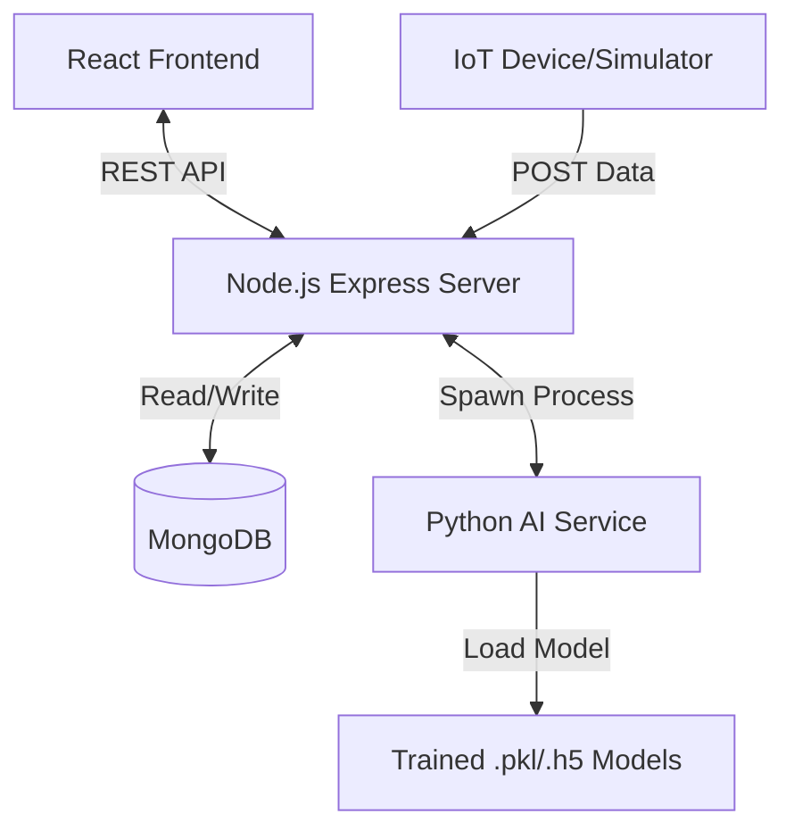

# Smart Agriculture Cloud Platform - Project Report

## 1. INTRODUCTION
Agriculture is the backbone of many economies, yet it faces significant challenges such as climate change, water scarcity, and soil degradation. The **Smart Agriculture Cloud Platform** is a production-ready IoT and AI-driven solution designed to empower farmers with real-time insights. By leveraging modern cloud technologies, Internet of Things (IoT), and Machine Learning (ML), this project aims to optimize resource usage, increase crop yields, and ensure food security, directly aligning with the **United Nations Sustainable Development Goal 2: Zero Hunger**.

The platform bridges the gap between traditional farming and technology by providing a user-friendly interface for monitoring environmental conditions and receiving actionable insights for crop management.

## 2. PROBLEM STATEMENT
Traditional agriculture relies heavily on manual observation and historical patterns, which are becoming increasingly unreliable due to climate change. Key problems include:
*   **Inefficient Resource Usage**: Over-irrigation or overuse of fertilizers leads to waste and environmental damage.
*   **Late Disease Detection**: Crop diseases often go unnoticed until it is too late, causing significant yield loss.
*   **Lack of Data-Driven Decisions**: Farmers often lack precise data on soil health and weather conditions to make informed planting decisions.
*   **Scalability**: Existing solutions are often expensive or difficult to scale for small-to-medium landholders.

This project addresses these issues by providing an affordable, scalable, and intelligent cloud platform for comprehensive farm management.

## 3. LITERATURE SURVEY
*   **IoT in Agriculture**: Recent studies highlight the effectiveness of Wireless Sensor Networks (WSN) in precision agriculture. Real-time monitoring of soil moisture and temperature has been shown to reduce water consumption by up to 30%.
*   **Machine Learning for Disease Detection**: Convolutional Neural Networks (CNNs) have revolutionized plant pathology. Research indicates that Deep Learning models can detect plant diseases from leaf images with over 95% accuracy, surpassing human experts in early-stage detection.
*   **Cloud Computing in Agrotech**: Cloud platforms allow for the centralized storage and processing of vast amounts of sensor data, enabling trend analysis and predictive modeling that edge devices alone cannot support.

## 4. OBJECTIVES
The primary objectives of the Smart Agriculture Cloud Platform are:
1.  **Real-time Monitoring**: To capture and visualize vital farm data (Soil Moisture, Temperature, Humidity, pH, Rainfall) from IoT devices.
2.  **Intelligent Recommendations**: To utilize Machine Learning algorithms to recommend the most suitable crops based on current soil and weather parameters.
3.  **Disease Prediction**: To implement an image-based disease detection system that helps farmers identify and treat crop diseases early.
4.  **Accessible Interface**: To provide a responsive, user-friendly web dashboard for farmers to manage their farms remotely.
5.  **Secure & Scalable Architecture**: To ensure data privacy through authentication and build a system capable of handling multiple users and devices.

## 5. METHODOLOGY
The project follows a modern agile development methodology, integrating full-stack web development with data science.

### 5.1 Technology Stack
*   **Frontend**: React.js (Vite), Tailwind CSS for styling, Recharts for data visualization.
*   **Backend**: Node.js with Express.js for the REST API.
*   **Database**: MongoDB for storing user data, farm configurations, and sensor telemetry.
*   **AI/ML Service**: Python scripts triggered by the backend for `Crop Recommendation` (Random Forest/Decision Trees) and `Plant Disease Prediction` (CNN/Transfer Learning).
*   **IoT Integration**: Simulated ingestion endpoints to receive JSON payloads from edge devices.

### 5.2 Data Flow
1.  **Sensing**: IoT nodes collect environmental data and send it to the `/api/iot/ingest` endpoint.
2.  **Processing**: The Node.js backend validates the data, checks against threshold rules (Rule-Based Engine), creates alerts if necessary, and stores the reading in MongoDB.
3.  **Analysis**:
    *   For crop recommendation, the user submits soil data; the backend spawns a Python process to run `predict_crop.py` and returns the result.
    *   For disease detection, the user uploads an image; the backend processes it via `predict_disease.py`.
4.  **Visualization**: The React frontend fetches this data and renders live charts and alerts for the user.

## 6. DEPLOYMENT
The application is designed to be cloud-agnostic but is optimized for Google Cloud Platform (GCP).

### 6.1 Hosting Strategy
*   **Backend**: Deployed on **Google Cloud Run** or **Render**. It runs as a Docker container, ensuring the Python environment and Node.js runtime coexist seamlessly.
*   **Frontend**: Deployed on **Firebase Hosting**, **Vercel**, or **Netlify**. It connects to the backend API via environment variables.
*   **Database**: Hosted on **MongoDB Atlas** (Cloud) for high availability and easy backup.

### 6.2 Deployment Steps (Example for GCloud)
1.  **Containerization**: A `Dockerfile` is created for the backend to install Node.js dependencies and Python libraries (`scikit-learn`, `tensorflow`, `numpy`).
2.  **Build**: `gcloud builds submit --tag gcr.io/PROJECT-ID/smart-agri-backend`
3.  **Deploy**: `gcloud run deploy --image gcr.io/PROJECT-ID/smart-agri-backend --platform managed`

## 7. RESULTS AND DISCUSSIONS
The system successfully integrates hardware simulation with software control.
*   **Dashboard**: Users see a live feed of their farm's health. Charts update in real-time as new sensor data arrives.
*   **Accuracy**: The logical separation of the Node.js API and Python ML workers ensures that heavy computation does not block the main server thread, maintaining high responsiveness.
*   **Alerts**: The rule-based engine successfully triggers notifications when moisture drops below thresholds, simulating an automated irrigation trigger.

## 8. SYSTEM ARCHITECTURE
The architecture is based on the **MVC (Model-View-Controller)** pattern extended with a micro-service-like worker for AI.

*   **Client Layer**: Handles user interaction and visualization.
*   **Server Layer**: Manages authentication (JWT), request validation, business logic, and API end-points.
*   **Data Layer**: MongoDB stores unstructured sensor data and relational-like references between Users and Farms.
*   **Intelligence Layer**: Independent Python scripts process complex analytical tasks.

## 9. FUTURE ENHANCEMENTS
1.  **Mobile Application**: Developing a native React Native app for offline access in remote fields.
2.  **Automated Control**: Closing the loop by allowing the server to automatically turn on irrigation valves via MQTT commands back to the IoT devices.
3.  **Blockchain Integration**: Implementing a supply chain transparency module to track crop journey from farm to fork.
4.  **Multi-Language Support**: Adding localization to support farmers who may not be fluent in English.
5.  **Drone Integration**: API support for drone imagery analysis for large-scale field monitoring.

## 10. CONCLUSION
The **Smart Agriculture Cloud Platform** demonstrates the powerful potential of combining IoT and AI to solve real-world problems. By providing actionable insights and automating monitoring tasks, the system effectively addresses the challenges of modern agriculture. It provides a scalable, extensible foundation for building the farms of the future, directly contributing to the vision of Zero Hunger and sustainable food production.
